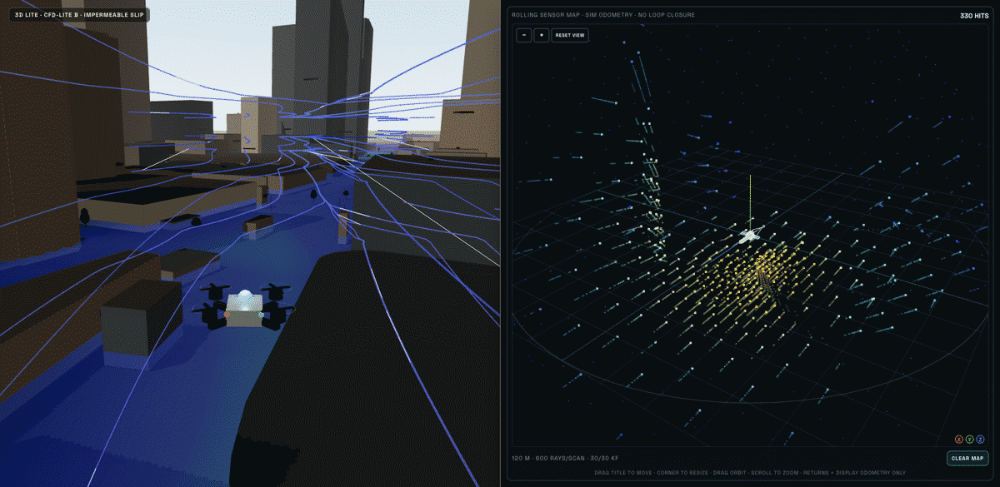
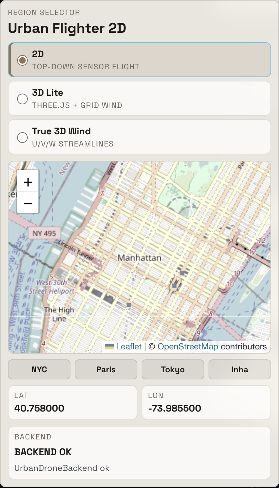
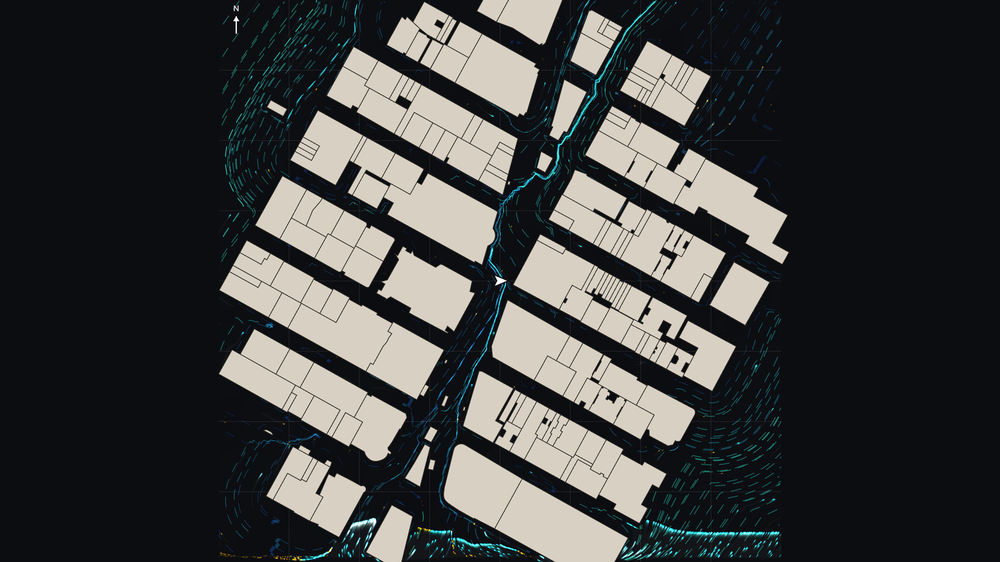
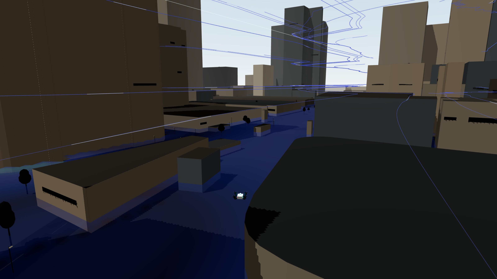
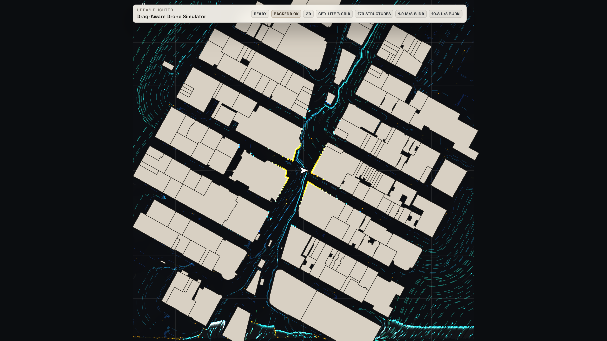
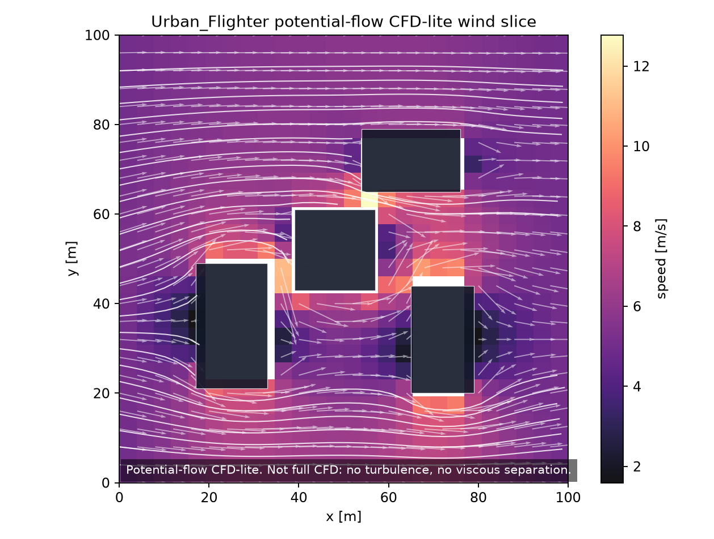

# Urban Flighter

**Click a city. Get the buildings. Get the weather. Fly a drone that actually pays drag.**

Then hand the same world to Gym.

Urban Flighter is a browser urban-air cockpit with a live city underneath it. You pick a lat/lon. The backend streams **OpenStreetMap geometry** and a **live location weather API**. A fast urban flow wraps that inlet around the blocks. A metre-scale quadrotor flies it in 2D or 3D, and the energy model burns for relative airspeed `v − w` — tailwind is cheap, headwind is expensive, a canyon wake can be both on one street.

That is the trick nobody else is shipping as a product: **live geometry + live weather + a flyable flow + quadratic drag**, in one stack you can open in a tab. Today the flow is a **toy CG model** (CFD-lite) so a laptop can keep up. Tomorrow a **CFD surrogate** drops into the same `ux,uy` slot. The cockpit, the drag core, and Gym do not care who wrote the field.

[](LICENSE)
&nbsp;
**Paper** [`urban_flighter.pdf`](paper/urban_flighter.pdf) · [source](paper/urban_flighter.tex)

<p align="center">
  
  <br />
  <sub>Midtown Manhattan · 3D Lite + urban flow · rolling sensor map</sub>
</p>

## Why it hits different

AirSim-class tools sell the screenshot. Full CFD sells the field and then you cannot fly it. Urban Flighter sells the **loop**: load the place, feel the air, keep the energy bill, train on the same contract.

| Superpower | What you get |
| --- | --- |
| **Any city, live** | OSM footprints and heights. Collision, LiDAR, and the flow mask are the same solids. Presets: NYC, Paris, Tokyo, Inha. Drop a landmark with `?lat=&lon=`. |
| **Live location weather** | Current 10 m wind for the point you picked. That inlet is on the HUD and in the actor observation. |
| **Urban flow you can fly** | Street canyons, wakes, impermeable slip. Interactive on a laptop. Built so a CFD surrogate can replace the toy CG field later. |
| **Drag that notices the city** | Shared quadratic air-relative core. Stick-off equilibrium is local wind. Heading into a jet costs watts. |
| **A real cockpit** | 2D, 3D Lite, True 3D Wind overlay. Deterministic returns. A rolling sensor map that moves with you. |
| **Gym-first** | UrbanFlow Gym is the same live OSM world, wired for training. 49-D actor observation. The policy never gets the god-mode velocity grid — that is the point, not a missing feature. |

No API key. First load needs network. Default: **Times Square**, ~180 buildings, ~10 s.

## Quick start

**Python 3.11+**, **Node 20+**, two terminals.

```bash
git clone https://github.com/VortexyAether/UrbanFlighter.git
cd UrbanFlighter

python3 -m venv .venv
source .venv/bin/activate          # Windows: .venv\Scripts\activate
python -m pip install -U pip
python -m pip install -r backend/requirements.txt

cd frontend && npm install && cd ..
```

**Terminal 1 — backend**

```bash
cd backend && ../.venv/bin/python main.py        # http://127.0.0.1:8000
```

**Terminal 2 — frontend**

```bash
cd frontend && npm run dev                        # http://127.0.0.1:5173
```

Open [http://127.0.0.1:5173](http://127.0.0.1:5173). Wait for `BACKEND OK` and the footprints. Then fly.

| | |
| --- | --- |
| **2D** | WASD |
| **3D Arcade** | W/S drive · A/D strafe · Q/E yaw · Space/Shift climb · R boost · F brake |
| **3D Pilot** | A/D yaw · Q/E strafe |
| Camera | `C` Chase / Orbit |
| Mode | Map / Mode → 2D, 3D Lite, True 3D Wind |

City stuck? Keep both terminals up and hit [http://127.0.0.1:8000/health](http://127.0.0.1:8000/health).

## Look around

Same session: **179 OSM buildings / 400 m**, inlet **1.9 m/s from 215°**.

<table>
  <tr>
    <td align="center" width="50%">
      
      <br />
      <sub><b>City</b> — click the map, load the blocks.</sub>
    </td>
    <td align="center" width="50%">
      
      <br />
      <sub><b>Flow</b> — weather inlet bent around those blocks.</sub>
    </td>
  </tr>
  <tr>
    <td align="center" width="50%">
      
      <br />
      <sub><b>3D Lite</b> — fly the same field in the canyon.</sub>
    </td>
    <td align="center" width="50%">
      
      <br />
      <sub><b>2D</b> — north-up, same drag, same city.</sub>
    </td>
  </tr>
</table>

## UrbanFlow Gym — this stack is for training

The cockpit is the demo. **Gym is the product trajectory.**

Every successful city load registers as `urbanflow.live_scenario.v1`. The headless env is that exact world: same footprints, same inlet, same hidden field. A policy sees what a vehicle could see — odometry, goal, 16-ray geometry LiDAR, 8-beam range–Doppler proxy, known weather inlet, last action, inlet-only relative air. It does **not** get the full `ux,uy` grid. Train against sensors and a forecast, not against a god-mode wind cheat.

Optional PPO / SAC extras are already on the shelf. Deterministic baselines and a live-world inspector are in the repo. This is the environment you put a learner on next.

```bash
curl http://127.0.0.1:8000/urbanflow-gym/spec
# after a UI location load:
curl http://127.0.0.1:8000/urbanflow-gym/live-scenarios/current
```

## The four engines

**Geometry** · `backend/services/geometry.py` · OSMnx → footprints + height. One mesh for collision, LiDAR, and the flow mask.

**Weather** · `backend/services/wind.py` · Live location weather API, current 10 m wind at the pin.

**Flow** · `backend/services/flow_2d.py` · Interactive urban field (streamfunction, walls, canyon / wake, impermeable slip). Swap-ready for a CFD surrogate on the same endpoint. 3D Lite flies this `ux,uy` grid. True 3D Wind adds a Gangnam u/v/w overlay.

**Sense** · `LocalReturns2D.tsx` / `LocalReturnsRadar.tsx` · Deterministic rays vs the OSM city. Rolling map tracks the aircraft as it moves.

| Mode | You fly | Extra |
| --- | --- | --- |
| 2D | Live horizontal field | 180-ray scan |
| 3D Lite | Same field | 600-sample spherical returns |
| True 3D Wind | Same field | Bundled u/v/w overlay |

## Offline spark

```bash
PYTHONPATH=backend python scripts/run_oss_showcase.py
```

<p align="center">
  
  <br />
  <sub>Five-building spark · 5 m/s west inlet · residual 9.8e-5</sub>
</p>

## Layout

```text
backend/                 FastAPI · OSM · weather · urban flow
backend/urbanflow_gym/   live-world Gym + inspector
frontend/                React + Three.js cockpit
docs/showcase/           live stills
paper/                   technical report
```

`CLAUDE.md` · `DESIGN.md`

## Tests

```bash
cd frontend && npm run lint && npm run smoke:lidar && npm run build
cd ../backend
../.venv/bin/python test_urbanflow_gym_core.py
../.venv/bin/python test_urbanflow_rl_foundation.py
../.venv/bin/python test_urbanflow_gym_api.py
PYTHONPATH=backend ../.venv/bin/python -m urbanflow_gym.eval_policy --seed 10007 --max-steps 80
```

## Cite

```bibtex
@techreport{jang2026urbanflighter,
  title  = {Urban Flighter: An Honest Urban-Air Simulator
            with CFD-lite Hidden Flow and Policy-Visible Sensing},
  author = {Jang, Jaewon},
  year   = {2026},
  note   = {Open-source technical report},
  url    = {https://github.com/VortexyAether/UrbanFlighter}
}
```

## License

MIT. See `LICENSE`.
