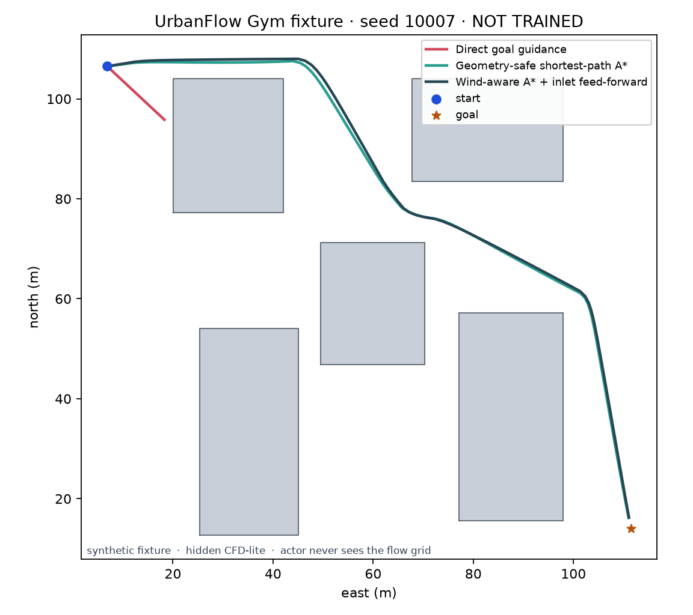
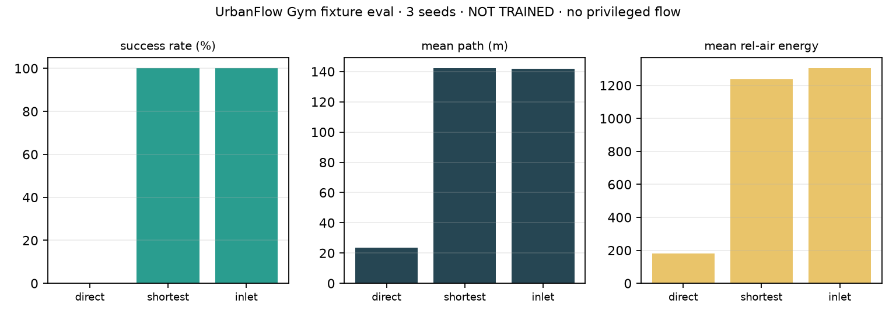

# Urban Flighter

Open-source **urban drone flight simulator**: real OSM buildings, forecast-model inlet wind, CFD-lite hidden flow, a browser cockpit, and an RL-ready (not trained) Gym contract.

[](LICENSE)

> CFD-lite is **not** Navier–Stokes. True 3D Wind is a **visual overlay**. LiDAR/maps are **simulator rays + odometry**, not hardware SLAM. UrbanFlow Gym is **NOT TRAINED**. The actor never sees the full flow grid.

**Paper:** [`paper/urban_flighter.pdf`](paper/urban_flighter.pdf) · source [`paper/urban_flighter.tex`](paper/urban_flighter.tex)

## What it is

- Fly a real city footprint in **2D**, **3D Lite**, or **True 3D Wind** (overlay).
- Backend: FastAPI + OSM + Open-Meteo + CFD-lite B (potential-flow / wall damping / empirical wake).
- Frontend: React 19 + Three.js cockpit, deterministic LiDAR-style returns, rolling sensor maps.
- **UrbanFlow Gym**: headless NumPy env, leakage guard, live-OSM scenario bridge, deterministic baselines.

## Showcase case (offline, no network)

This is the public demo. It is a contract test, not a “wind-aware always wins” claim.

```bash
PYTHONPATH=backend python scripts/run_oss_showcase.py
```

Writes `docs/showcase/`.

**Potential-flow CFD-lite (toy city)** — 5 buildings, 5 m/s westerly inlet, 26×26 grid, residual 9.8e-5, max speed 12.8 m/s:


**UrbanFlow Gym fixture · seed 10007 · NOT TRAINED** — direct goal collides; geometry-safe A* and inlet-aware A* both succeed:



**3 seeds {10007, 10009, 10037}, 240 steps** (hidden synthetic flow, `policy_full_flow_access=false`):

| Baseline | Success | Mean path (m) | Rel-air energy | Collision eps. |
| --- | --- | --- | --- | --- |
| Direct goal | 0/3 | 23.5 | 180 | 3/3 |
| Shortest-path A* | 3/3 | 142.1 | 1236 | 0/3 |
| Inlet-aware A* | 3/3 | 141.9 | 1303 | 0/3 |

Inlet-aware is **not** energy-better here. That regression is part of the demo.



Reproduce numbers: `docs/showcase/showcase_summary.json`.

## Quick start (interactive cockpit)

```bash
# backend
cd backend
../.venv/bin/python main.py          # http://127.0.0.1:8000

# frontend
cd frontend
npm install
npm run dev                          # http://127.0.0.1:5173
```

OSM + Open-Meteo are free; no API key. First city load needs network.

### Controls

- **2D:** WASD
- **3D Arcade:** W/S forward, A/D strafe, Q/E yaw, Space/Shift climb, R boost, F brake
- **3D Pilot:** A/D yaw, Q/E strafe
- `C` Chase / Orbit

## Modes (honest)

| Mode | Flyable wind | Extra |
| --- | --- | --- |
| 2D | Live horizontal CFD-lite B grid | 180-ray scan, rolling 2D map |
| 3D Lite | Same B grid | 600-sample spherical returns, 3D map |
| True 3D Wind | Still the B grid | Bundled Gangnam u/v/w streamlines |

Presentation trees/roads/beacons are **scenery only**. They do not enter collision, LiDAR, Gym, reward, or scenario hashes.

## UrbanFlow Gym

Status: `LIVE OSM WORLD · NOT TRAINED`.

Actor sees motion, goal, geometry LiDAR, known inlet, previous action, onboard relative-air estimate. Never the velocity grid.

```bash
curl http://127.0.0.1:8000/urbanflow-gym/spec
# after a UI location load:
curl http://127.0.0.1:8000/urbanflow-gym/live-scenarios/current
```

Optional training extras are **not** on the default path. No shipped weights.

## Layout

```text
backend/                 FastAPI, OSM, weather, CFD-lite
backend/urbanflow_gym/   headless env + inspector API
frontend/                React + Three.js cockpit
scripts/run_oss_showcase.py
docs/showcase/           committed demo figures + metrics
paper/                   technical report (LaTeX + PDF)
```

Contributor notes: `CLAUDE.md`. Design tokens: `DESIGN.md`.

## Tests

```bash
cd frontend && npm run lint && npm run smoke:lidar && npm run build
cd ../backend
../.venv/bin/python test_urbanflow_gym_core.py
../.venv/bin/python test_urbanflow_gym_api.py
```

## Cite

```bibtex
@techreport{jang2026urbanflighter,
  title  = {Urban Flighter: An Honest Urban-Air Simulator
            with CFD-lite Hidden Flow and Policy-Visible Sensing},
  author = {Jang, Jaewon},
  year   = {2026},
  note   = {Open-source technical report},
  url    = {https://github.com/VortexyAether/Urban_Flighter}
}
```

## License

MIT. See `LICENSE`.
