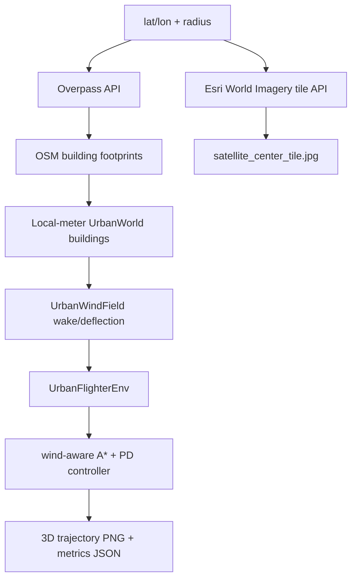

# Real-city OSM + satellite demo

This prototype connects the RL-ready Python simulator to **actual city data** instead of the toy 5-building scene.

## What it fetches

- **Buildings:** OpenStreetMap building footprints through the Overpass API.
- **Satellite context:** Esri World Imagery center tile through the ArcGIS REST tile endpoint.
- **Simulator geometry:** OSM footprints are converted into local-meter, axis-aligned 3D building prisms for the existing `UrbanWorld` collision/wind model.

No API key is required for the current MVP path.

## New files

```text
backend/urban_flighter_rl/data_sources.py
scripts/run_real_city_demo.py
docs/real_city_osm_satellite_demo.md
```

## Run

```bash
cd .
source .venv/bin/activate
PYTHONPATH=backend python scripts/run_real_city_demo.py \
  --lat 37.497942 \
  --lon 127.027621 \
  --radius 260 \
  --max-buildings 120 \
  --out results/real_city_gangnam
```

## Verified run: Gangnam real-city patch

Actual command was run on 2026-06-19.

```text
lat: 37.497942
lon: 127.027621
radius_m: 260.0
osm_buildings: 120
osm_elements: 178
satellite_source: Esri World Imagery tile API
satellite_tile_url: https://server.arcgisonline.com/ArcGIS/rest/services/World_Imagery/MapServer/tile/17/50789/111785
```

Metrics:

```text
success: True
steps: 547
sim_time_s: 136.75
path_length_m: 611.0250829719447
energy_relative_airspeed_l2: 1756.777089797301
collisions: 0
final_distance_m: 3.3332210068897776
controller: wind_aware_grid_astar_pd
waypoint_count: 97
```

Artifacts:

```text
results/real_city_gangnam/urban_flighter_real_city_3d_demo.png
results/real_city_gangnam/urban_flighter_real_city_metrics.json
results/real_city_gangnam/osm_buildings_meta.json
results/real_city_gangnam/satellite_center_tile.jpg
results/real_city_gangnam/satellite_tile_meta.json
```

## Implementation note

Current conversion is deliberately MVP-grade:

```text
OSM polygon footprint
→ local tangent-plane meters around selected lat/lon
→ axis-aligned bounding rectangle
→ 3D building prism
→ wind-aware A* + PD baseline
```

That keeps the existing collision, wind wake, and planner code working. The next improvement is to preserve full polygon footprints in `UrbanWorld` instead of simplifying to axis-aligned rectangles.

## Data flow



## Limitations

- Satellite tile is fetched and recorded as geographic context; it is not yet draped under the matplotlib 3D scene.
- OSM polygons are simplified into axis-aligned prisms; exact polygon collision is a follow-up.
- Weather is not yet wired into this new script; the backend already has Open-Meteo support, and this script should reuse it next.
