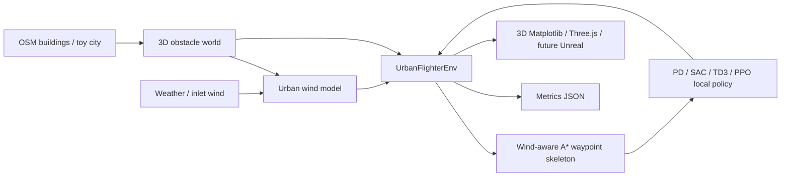

# Urban Flighter Simulator Architecture v2

This document mirrors the Obsidian architecture note for the runnable overnight 3D prototype and near-term simulator direction.

## Current runnable prototype

Run from the repo root:

```bash
cd .
source .venv/bin/activate
PYTHONPATH=backend python scripts/run_3d_rl_demo.py
```

Verified output on 2026-06-19:

- `results/urban_flighter_3d_demo.png`
- `results/urban_flighter_metrics.json`
- success: `true`
- steps: `116`
- sim time: `29.0 s`
- path length: `126.3872686151311 m`
- relative-air-speed L2 energy: `326.18772670367287`
- collisions: `0`
- final distance: `3.7351735851962324 m`
- controller: `wind_aware_grid_astar_pd`
- waypoint count: `22`

## Architectural choice

Keep the Python Gymnasium-style environment as the research/control core, while the existing React/Three.js frontend remains the quickest browser visualization path. Use Unreal/AirSim only after the control API is stable and photorealistic perception or hardware-in-the-loop physics becomes the bottleneck.



## Energy model constraint

The prototype intentionally keeps energy simple and aligned with VA's requirement:

```text
v_air = v_ground - w_local(x, y, z, t)
cost = Σ ||v_air||² Δt
```

Battery chemistry, hover-power calibration, induced-rotor losses, and payload-specific curves are intentionally out of scope until the relative-air-speed optimizer is working robustly.

## Research-backed implementation notes

- AirSim has documented Gym-style RL wrappers and integrates with stable-baselines examples; this supports a future Unreal bridge but is heavier than the current Python core for iteration: https://microsoft.github.io/AirSim/reinforcement_learning
- AirSim Drone Racing Lab exposes trajectory APIs such as spline/path tracking and low/medium-level drone control, useful when moving from toy world to photorealistic racing/urban courses: https://msl.stanford.edu/papers/madaan_airsim_2020.pdf
- Stable-Baselines3 recommends normalized inputs and careful custom-environment evaluation; SAC is a natural first algorithm for continuous 3D acceleration actions: https://stable-baselines3.readthedocs.io/en/master/guide/rl_tips.html and https://stable-baselines3.readthedocs.io/en/master/modules/sac.html
- CesiumJS can stream terrain, imagery, and 3D buildings for browser-based real-city visualization; this is better than hand-made Three.js meshes when geospatial scale matters: https://cesium.com/learn/cesiumjs-learn/cesiumjs-interactive-building
- OSM2World exports OSM-derived 3D models to glTF/glb/OBJ and can be a practical bridge from OSM data to Three.js/Cesium assets: https://osm2world.org

## Near-term roadmap

1. Add a minimal Gymnasium compatibility wrapper with `observation_space`, `action_space`, and deterministic seeding.
2. Train/evaluate SAC and TD3 against the current A*+PD baseline, reporting success rate, energy, collisions, and path length.
3. Replace toy-city boxes with OSM footprints already fetched by the backend, preserving the same `UrbanWorld` API.
4. Add wind-model tiers: heuristic wake model → backend voxel field → AeroJAX/CFD snapshot sampling.
5. Expose the prototype trajectory as JSON for the existing React/Three.js frontend so VA can inspect results interactively.
